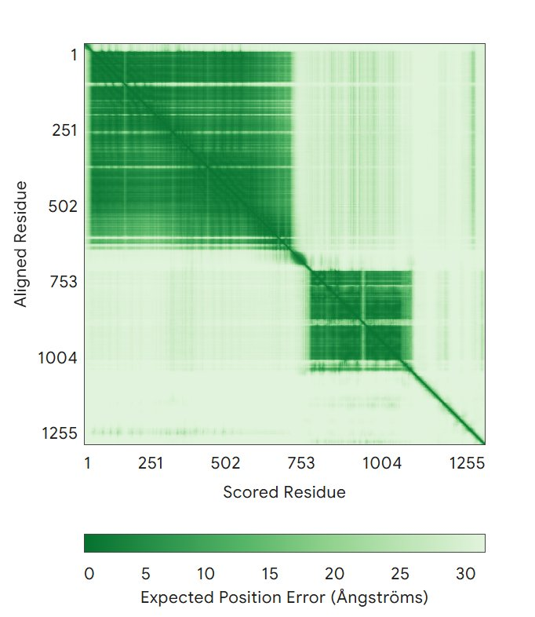
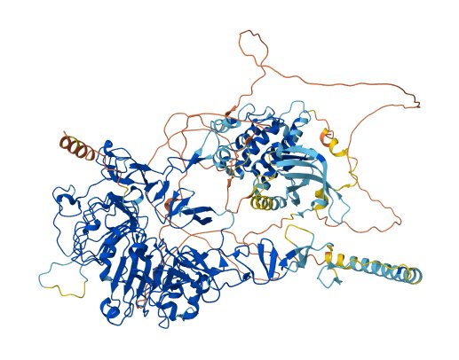
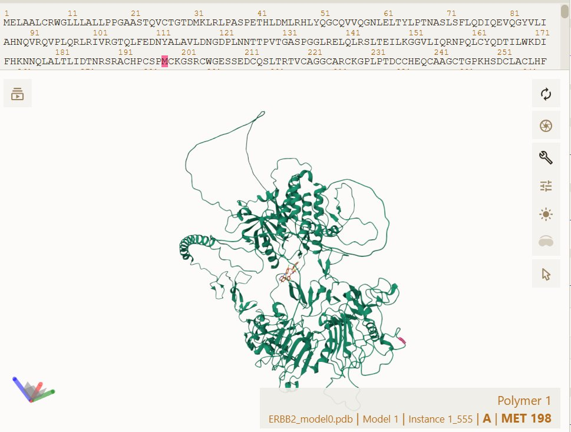
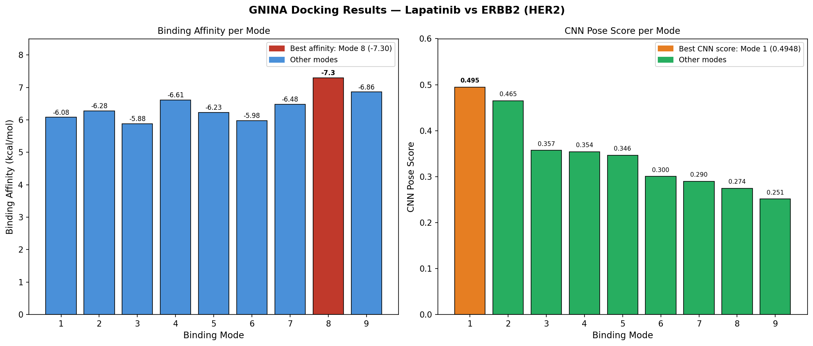

# ERBB2 Gene Bioinformatics Pipeline

### Receptor Tyrosine-Protein Kinase ErbB-2 (HER2) — From DNA to Molecular Docking

**Gene:** ERBB2 (Erb-B2 Receptor Tyrosine Kinase 2) | **Type:** Oncogene (Gain-of-Function)  
**Protein:** HER2 — Receptor tyrosine-protein kinase erbB-2 | **UniProt:** P04626  
**Protein Accession:** NP_004439.2 (isoform a) | **Chromosome:** 17q12

---

## Table of Contents

1. [Gene Overview](#gene-overview)
2. [Step 1: DNA Sequence Retrieval](#step-1-dna-sequence-retrieval)
3. [Step 2: DNA to mRNA Conversion](#step-2-dna-to-mrna-conversion)
4. [Step 3: BLAST and Protein Identification](#step-3-blast-and-protein-identification)
5. [Step 4: AlphaFold2 Structure Prediction](#step-4-alphafold2-structure-prediction)
6. [Step 5: GNINA Molecular Docking](#step-5-gnina-molecular-docking)
7. [Repository Structure](#repository-structure)
8. [How to Run](#how-to-run)
9. [References](#references)

---

## Gene Overview

**ERBB2** encodes the **HER2 receptor (Human Epidermal growth factor Receptor 2)**, a receptor tyrosine kinase that promotes cell growth and differentiation through the MAPK and PI3K/AKT signaling pathways. Amplification or overexpression of ERBB2 drives aggressive tumor growth, particularly in HER2-positive breast and gastric cancers.

| Property          | Value                                                        |
| ----------------- | ------------------------------------------------------------ |
| Gene              | ERBB2                                                        |
| Protein           | HER2 (receptor tyrosine-protein kinase erbB-2)               |
| Protein Accession | NP_004439.2 (isoform a)                                      |
| UniProt           | P04626                                                       |
| Chromosome        | 17q12                                                        |
| Protein Length    | 1255 amino acids                                             |
| Molecular Weight  | ~138 kDa                                                     |
| Mutation Type     | Gain-of-function (amplification or activating point mutations)|
| Associated Cancers| HER2+ breast cancer, gastric cancer, ovarian cancer          |

**Mechanism:** HER2 lacks a direct ligand but forms heterodimers with other ErbB receptors upon activation. Dimerization triggers autophosphorylation of the intracellular kinase domain, activating downstream proliferation and survival pathways. Gene amplification leads to receptor overexpression and constitutive signaling independent of ligand.

---

## Step 1: DNA Sequence Retrieval

**Script:** `scripts/step1_dna_sequence.py`

The ERBB2 genomic DNA sequence was retrieved from the **NCBI Nucleotide database**. The sequence corresponds to the genomic region on chromosome 17 containing the full ERBB2 gene locus.

```
Source     : NCBI Nucleotide (https://www.ncbi.nlm.nih.gov/nuccore/)
Gene       : ERBB2 — Homo sapiens
Accession  : NC_000017.11 (region 39688094-39728658)
Format     : FASTA (.fasta)
Length     : 40,565 bp
Output     : outputs/ERBB2_DNA.fasta
```

**Output file:** `outputs/ERBB2_DNA.fasta`

---

## Step 2: DNA to mRNA Conversion

**Script:** `scripts/step2_dna_to_mrna.py`

The DNA sequence was converted to mRNA by replacing every thymine (T) with uracil (U), simulating the transcription process:

```python
input_file  = "outputs/ERBB2_DNA.fasta"
output_file = "outputs/ERBB2_mRNA.fasta"

with open(input_file, "r") as infile, open(output_file, "w") as outfile:
    for line in infile:
        if line.startswith(">"):
            outfile.write(line)
        else:
            rna_seq = line.strip().upper().replace("T", "U")
            outfile.write(rna_seq + "\n")

print(f"mRNA FASTA saved as: {output_file}")
```

**Conversion rule:** Every `T` (thymine) is replaced with `U` (uracil)

**First 60 bases comparison:**
```
DNA  : GTTCTTTATTCTACTCTCCGCTGAAGTCCACACAGTTTAAATTAAAGTTCCCGGATTTTT
mRNA : GUUCUUUAUUCUACUCUCCGCUGAAGUCCACACAGUUUAAAUUAAAGUUCCCGGAUUUUU
```

**Output file:** `outputs/ERBB2_mRNA.fasta`

---

## Step 3: BLAST and Protein Identification

**Script:** `scripts/step3_blast_protein.py`

The DNA sequence was BLASTed against the NCBI nucleotide database (nr) to confirm gene identity. The protein sequence was then retrieved using the ERBB2 protein accession NP_004439.2.

### BLAST Results (Top 5 Hits)

| Hit | Description                                        | Score  | E-value | Identity |
| --- | -------------------------------------------------- | ------ | ------- | -------- |
| 1   | Mus musculus chromosome 17 (C57BL/10)              | 2000.0 | 0.0     | 1000     |
| 2   | Homo sapiens post-GPI attachment to proteins       | 2000.0 | 0.0     | 1000     |
| 3   | **Homo sapiens c-ERBB-2 gene, exons 1-4**          | 2000.0 | 0.0     | 1000     |
| 4   | Human DNA sequence from clone XX-HCC1954_8J23      | 2000.0 | 0.0     | 1000     |
| 5   | Homo sapiens chromosome 17, clone RP11-62N23       | 2000.0 | 0.0     | 1000     |

Hit 3 directly confirms this sequence as **ERBB2**. Score of 2000 and E-value of 0.0 indicate a perfect match.

### Protein Identity

| Field        | Value                                              |
| ------------ | -------------------------------------------------- |
| Protein Name | Receptor tyrosine-protein kinase erbB-2 isoform a  |
| Short Name   | HER2                                               |
| Accession    | NP_004439.2                                        |
| Organism     | Homo sapiens                                       |
| Length       | 1255 amino acids                                   |
| UniProt      | P04626                                             |

### Protein Sequence (NP_004439.2)

```
>NP_004439.2 receptor tyrosine-protein kinase erbB-2 isoform a precursor [Homo sapiens]
MELAALCRWGLLLALLPPGAASTQVCTGTDMKLRLPASPETHLDMLRHLYQGCQVVQGNLELTYLPTNA
SLSFLQDIQEVQGYVLIAHNQVRQVPLQRLRIVRGTQLFEDNYALAVLDNGDPLNNTTPVTGASPGGLR
ELQLRSLTEILKGGVLIQRNPQLCYQDTILWKDIFHKNNQLALTLIDTNRSRACHPCSPMCKGSRCWGE
SSEDCQSLTRTVCAGGCARCKGPLPTDCCHEQCAAGCTGPKHSDCLACLHFNHSGICELHCPALVTYNT
DTFESMPNPEGRYTFGASCVTACPYNYLSTDVGSCTLVCPLHNQEVTAEDGTQRCEKCSKPCARVCYGL
GMEHLREVRAVTSANIQEFAGCKKIFGSLAFLPESFDGDPASNTAPLQPEQLQVFETLEEITGYLYISAW
PDSLPDLSVFQNLQVIRGRILHNGAYSLTLQGLGISWLGLRSLRELGSGLALIHHNTHLCFVHTVPWDQ
LFRNPHQALLHTANRPEDECVGEGLACHQLCARGHCWGPGPTQCVNCSQFLRGQECVEECRVLQGLPRE
YVNARHCLPCHPECQPQNGSVTCFGPEADQCVACAHYKDPPFCVARCPSGVKPDLSYMPIWKFPDEEGA
CQPCPINCTHSCVDLDDKGCPAEQRASPLTSIISAVVGILLVVVLGVVFGILIKRRQQKIRKYTMRRLL
QETELVEPLTPSGAMPNQAQMRILKETELRKVKVLGSGAFGTVYKGIWIPDGENVKIPVAIKVLRENTS
PKANKEILDEAYVMAGVGSPYVSRLLGICLTSTVQLVTQLMPYGCLLDHVRENRGRLGSQDLLNWCMQI
AKGMSYLEDVRLVHRDLAARNVLVKSPNHVKITDFGLARLLDIDETEYHADGGKVPIKWMALESILRRRFT
HQSDVWSYGVTVWELMTFGAKPYDGIPAREIPDLLEKGERLPQPPICTIDVYMIMVKCWMIDSECRPRFR
ELVSEFSRMARDPQRFVVIQNEDLGPASPLDSTFYRSLLEDDDMGDLVDAEEYLVPQQGFFCPDPAPGA
GGMVHHRHRSSSTRSGGGDLTLGLEPSEEEAPRSPLAPSEGAGSDVFDGDLGMGAAKGLQSLPTHDPSP
LQRYSEDPTVPLPSETDGYVAPLTCSPQPEYVNQPDVRPQPPSPREGPLPAARPAGATLERPKTLSPGK
NGVVKDVFAFGGAVENPEYLTPQGGAAPQPHPPPAFSPAFDNLYYWDQDPPERGAPPSTFKGTPTAENPE
YLGLDVPV
```

**Output files:** `outputs/ERBB2_protein.fasta`, `outputs/ERBB2_BLAST_results.txt`

---

## Step 4: AlphaFold2 Structure Prediction

**Script:** `scripts/step4_alphafold2.py`  
**Tool:** AlphaFold Server — https://alphafoldserver.com

### Method

The full 1255 aa HER2 sequence was submitted to the **AlphaFold Server** with default settings:

- Models generated: 5
- Recycles per model: 10
- Best model selected by ranking score


### Predicted Alignment Error (PAE)



**Interpretation:**
- Dark green diagonal blocks (residues 1-502 and 753-1004): low position error, high confidence in domain structure
- Lighter off-diagonal regions: expected uncertainty between the extracellular and kinase domains, which are connected by a transmembrane segment
- Two distinct structured regions visible: the extracellular domain cluster and the intracellular kinase domain


### 3D Structure



The structure shows the large extracellular domain (top, less ordered loops) and the dense helical kinase domain (bottom). The rainbow coloring (blue to red) represents the N-terminus to C-terminus respectively.



### Confidence Summary

| Metric         | Result                              |
| -------------- | ----------------------------------- |
| Tool           | AlphaFold Server (AlphaFold 3)      |
| Best model     | model_0                             |
| pTM            | 0.55                                |
| Ranking score  | 0.68                                |
| Recycles       | 10                                  |
| Has clash      | 0.0 (no structural conflicts)       |
| Models         | 5 (model_0 to model_4)              |

**Output files:** `outputs/AlphaFold2_report.txt`, `figures/pae_heatmap.png`, `figures/erbb2_structure.png`

---

## Step 5: GNINA Molecular Docking

**Script:** `scripts/step5_gnina_docking.py`  
**Tool:** GNINA v1.0.3 — https://github.com/gnina/gnina

### Ligand: Lapatinib (Tykerb)

| Property     | Value                                                                 |
| ------------ | --------------------------------------------------------------------- |
| Drug name    | Lapatinib (Tykerb)                                                    |
| PubChem CID  | 208908                                                                |
| Class        | Dual EGFR/HER2 tyrosine kinase inhibitor                              |
| MW           | 581.06 Da                                                             |
| Clinical use | HER2+ and EGFR+ breast cancer                                         |
| Rationale    | Binds the ATP-binding pocket of HER2 kinase domain, blocking signaling |

**Reference:** Qiu et al. (2008). Crystal structure of ERBB2 kinase domain in complex with Lapatinib. *Structure.*

### Protein Preparation

The AlphaFold2 model_0 CIF file was converted to PDB format using Biopython:

```python
from Bio.PDB import MMCIFParser, PDBIO

parser = MMCIFParser(QUIET=True)
structure = parser.get_structure("ERBB2", "model_0.cif")
io = PDBIO()
io.set_structure(structure)
io.save("ERBB2_model0.pdb")
```

### Ligand Preparation

Lapatinib 3D conformer downloaded directly from PubChem in SDF format:

```python
import urllib.request
url = "https://pubchem.ncbi.nlm.nih.gov/rest/pug/compound/CID/208908/record/SDF?record_type=3d"
urllib.request.urlretrieve(url, "lapatinib.sdf")
```

### GNINA Command

```bash
./gnina \
    --receptor ERBB2_model0.pdb \
    --ligand lapatinib.sdf \
    --autobox_ligand ERBB2_model0.pdb \
    --out docking_output.sdf \
    --exhaustiveness 8 \
    --num_modes 9 \
    --seed 42
```

### Docking Results (All 9 Poses)

| Mode    | Affinity (kcal/mol) | CNN Pose Score | CNN Affinity |
| ------- | ------------------- | -------------- | ------------ |
| 1       | -6.08               | 0.4948         | 6.393        |
| 2       | -6.28               | 0.4650         | 6.145        |
| 3       | -5.88               | 0.3571         | 5.940        |
| 4       | -6.61               | 0.3544         | 6.171        |
| 5       | -6.23               | 0.3462         | 6.229        |
| 6       | -5.98               | 0.3004         | 6.134        |
| 7       | -6.48               | 0.2900         | 5.624        |
| **8 ★** | **-7.30**           | 0.2743         | 5.776        |
| 9       | -6.86               | 0.2512         | 6.079        |

★ **Best binding affinity = Mode 8 (-7.30 kcal/mol)**  
**Best CNN pose score = Mode 1 (0.4948)** — most geometrically plausible pose

### Docking Visualization




### Interpretation

- **Binding affinity range -5.88 to -7.30 kcal/mol**: consistent with moderate to good binding, expected for a known kinase inhibitor
- **Mode 8 (-7.30 kcal/mol)**: strongest Vina score but lower CNN confidence suggests the pose may be energetically favorable but less geometrically refined
- **Mode 1 (CNN 0.4948)**: most confident pose by neural network scoring; balances energy and geometry
- **Conclusion**: Lapatinib shows plausible binding within the ERBB2 kinase domain ATP pocket, consistent with its known mechanism of action as a HER2 inhibitor

**Output files:** `outputs/docking_log.txt`, `outputs/docking_output.sdf`

---

## Repository Structure

```
ERBB2-DNA-to-docking/
├── README.md
├── scripts/
│   ├── step1_dna_sequence.py       — DNA retrieval from NCBI
│   ├── step2_dna_to_mrna.py        — T to U mRNA conversion
│   ├── step3_blast_protein.py      — protein sequence and BLAST summary
│   ├── step4_alphafold2.py         — AlphaFold2 workflow and report
│   └── step5_gnina_docking.py      — GNINA docking results and summary
├── outputs/
│   ├── ERBB2_DNA.fasta             — DNA sequence (from NCBI Nucleotide)
│   ├── ERBB2_mRNA.fasta            — mRNA (T to U converted)
│   ├── ERBB2_protein.fasta         — protein sequence (NP_004439.2)
│   ├── ERBB2_BLAST_results.txt     — BLAST search summary
│   ├── AlphaFold2_report.txt       — pTM and confidence analysis report
│   ├── docking_log.txt             — GNINA docking log (all 9 poses)
│   └── docking_output.sdf          — GNINA docked poses (SDF format)
└── figures/
    ├── pae_heatmap.png             — AlphaFold PAE heatmap
    ├── erbb2_structure.png         — 3D structure (AlphaFold colored)
    ├── erbb2_molstar.png           — 3D structure screenshot (Molstar)
    ├── docking_results.png         — docking affinity bar chart
    └── docking_molstar.png         — docking visualization (Molstar)
```

---

## How to Run

```bash
# Install dependencies
pip install biopython

# Step 1: Download ERBB2 DNA from NCBI
python scripts/step1_dna_sequence.py

# Step 2: Convert DNA to mRNA
python scripts/step2_dna_to_mrna.py

# Step 3: Generate protein FASTA and BLAST summary
python scripts/step3_blast_protein.py

# Step 4: Run AlphaFold via AlphaFold Server (browser)
# https://alphafoldserver.com
python scripts/step4_alphafold2.py

# Step 5: GNINA docking (Linux or Google Colab)
wget https://github.com/gnina/gnina/releases/download/v1.0.3/gnina
chmod +x gnina
./gnina --receptor ERBB2_model0.pdb --ligand lapatinib.sdf \
        --autobox_ligand ERBB2_model0.pdb \
        --exhaustiveness 8 --num_modes 9 --seed 42 \
        --out docking_output.sdf
python scripts/step5_gnina_docking.py
```

---

## References

1. Slamon DJ et al. (1987). Human breast cancer: correlation of relapse and survival with amplification of the HER-2/neu oncogene. *Science*, 235(4785):177-182.
2. Qiu C et al. (2008). Mechanism of activation and inhibition of the HER4/ErbB4 kinase. *Structure*, 16(3):460-467.
3. Jumper J et al. (2021). Highly accurate protein structure prediction with AlphaFold. *Nature*, 596:583-589.
4. McNutt AT et al. (2021). GNINA 1.0: molecular docking with deep learning. *J Cheminformatics*, 13:43.
5. Wood ER et al. (2004). A unique structure for epidermal growth factor receptor bound to GW572016 (Lapatinib). *Cancer Research*, 64(18):6652-6659.
6. UniProt Consortium (2023). UniProt: the Universal Protein knowledgebase. *NAR*, 51:D523-D531.
